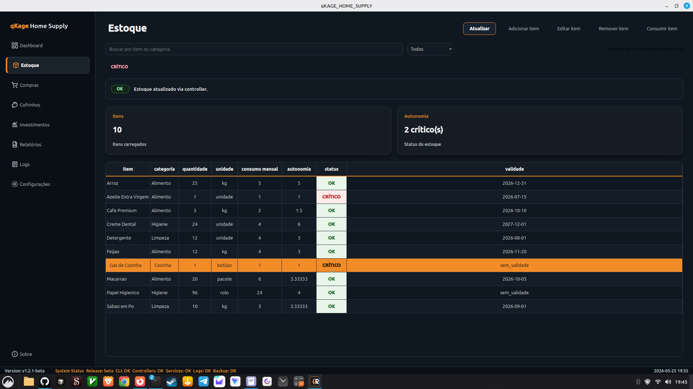
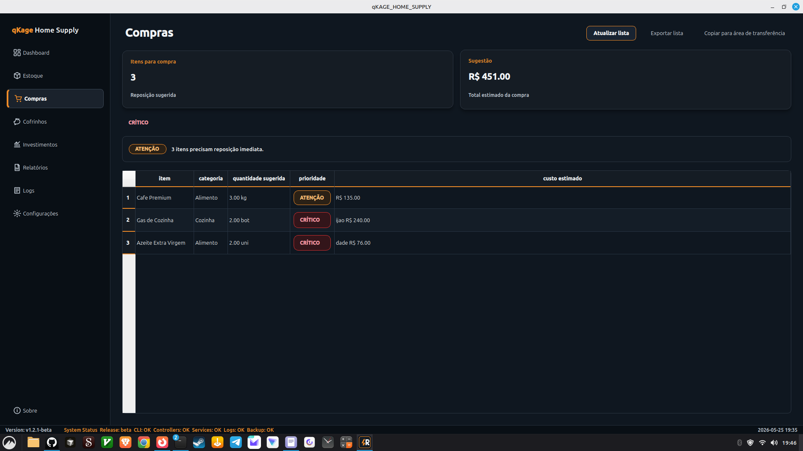

# qKAGE_HOME_SUPPLY


Domestic Supply & Financial Logistics System.

**Menos desperdício. Mais autonomia. Mais capital livre.**

`qKAGE_HOME_SUPPLY` is a local-first C++17/Qt6 system for household stock control, consumption planning, operational logs, reports, backups and financial logistics.

Current release: **v1.2.1-beta**.

## Screenshots

### Dashboard


### Estoque



### Compras



### Relatórios


### Sobre


## Architecture

```text
CLI / Qt Widgets
    |
Controllers
    |
Services
    |
Core / Storage / CSV / Reports / Logs
```

Boundaries:

- UI consumes controllers only.
- Controllers adapt CLI and Qt calls.
- Services orchestrate application flows.
- Core/storage modules hold domain and persistence details.
- CSV remains the local persistence layer for this beta.
- SQLite and Google Drive are intentionally out of scope for this release.

## Technical Stack

- C++17
- Qt6 Widgets
- CMake modular build
- CSV persistence
- Qt Resource System assets
- Shell scripts for auxiliary operations
- Linux

## Features

- CLI dispatcher with validated commands.
- Stock listing, add, edit, consume and safe removal.
- Shopping list generation.
- Stock autonomy, expiration and rotation reports.
- Monthly consolidated reports.
- Markdown report export.
- Piggy bank and financial projection flows.
- Operational logs with level filtering.
- Backup and integrity check flows.
- Qt Widgets GUI with:
  - Dashboard
  - StockPage
  - ShoppingPage
  - PiggyBankPage
  - InvestmentsPage
  - ReportsPage
  - LogsPage
  - SettingsPage
  - AboutDialog
- ThemeManager, StatusBadge, FeedbackBanner, InfoCard and OperationalChartWidget.

## Dashboard

The Dashboard is the operational cockpit for the Qt application. It is controller-driven and combines:

- summary InfoCards for stock, savings and piggy bank indicators;
- compact operational status synchronized with the feedback banner;
- integrated FeedbackBanner for success, warning, no-data and error states;
- QPainter-based operational gauges;
- Operational Temporal Chart for recent operational trend visualization;
- operational summary cards for backups, error logs and general state.
- connected purchases, piggy bank progress and projected investment capital.

## Shopping

Compras uses the automatic replenishment engine to flag items where `quantidade <= estoque_minimo` or autonomy is below two months. The Qt page displays item, category, suggested quantity, priority and estimated cost, with CRÍTICO/ATENÇÃO states and a consolidated purchase total.

## Investments

InvestmentsPage provides a financial demo mode for investment-focused workflows. In v1.2.1-beta it displays free capital, monthly and annual projections, simulated compound interest and a 12-month temporal chart.

## Piggy Banks

Cofrinhos displays CSV-backed financial goals with current value, target, percentage, monthly contribution and status. Horizontal progress bars use green, orange and red states to make goal health visible at a glance.

## OperationalChart

OperationalChartWidget renders temporal operational data in the Dashboard. It supports populated series and placeholder states, and is covered by Qt widget validation to prevent blank rendering and layout regressions.

## Directory Structure

```text
.
├── assets/
│   ├── icons/
│   └── logo/
├── data/
├── docs/
│   ├── demo/
│   └── screenshots/
├── scripts/
├── src/
│   ├── cli/
│   ├── controllers/
│   ├── services/
│   ├── core/
│   ├── csv/
│   ├── logging/
│   ├── report/
│   ├── storage/
│   └── ui/
├── tests/
├── build/              # generated locally
├── CMakeLists.txt
├── CHANGELOG.md
├── LICENSE
└── README.md
```

## Build

Requirements:

- CMake 3.16+
- C++17 compiler
- Qt6 Widgets

Linux Mint/Ubuntu setup:

```bash
sudo apt update
sudo apt install build-essential cmake qt6-base-dev qt6-base-dev-tools
```

Build:

```bash
cmake -S . -B build
cmake --build build
```

Run tests:

```bash
ctest --test-dir build --output-on-failure
```

## Run CLI

Show help:

```bash
./build/qKAGE_HOME_SUPPLY help
```

Common commands:

```bash
./build/qKAGE_HOME_SUPPLY list
./build/qKAGE_HOME_SUPPLY add "Arroz" "Alimentos" 5 "kg" 1 7.50 2027-12-31 1
./build/qKAGE_HOME_SUPPLY consume "Arroz" 1 "uso mensal"
./build/qKAGE_HOME_SUPPLY shopping-list
./build/qKAGE_HOME_SUPPLY monthly-report
./build/qKAGE_HOME_SUPPLY export-report
./build/qKAGE_HOME_SUPPLY logs-show ERROR
./build/qKAGE_HOME_SUPPLY backup
./build/qKAGE_HOME_SUPPLY config-show
```

## Run GUI

```bash
./build/qKAGE_HOME_SUPPLY --gui
```

The GUI is controller-driven and does not access CSV, services or core modules directly.

## Visual Identity

- Brand: qKage Home Supply.
- Base: dark graphite / blue-black.
- Panels: dark gray.
- Text: soft white and light gray.
- Accent: operational orange `#f28c28`.
- Sidebar icons are loaded through Qt Resource System from `assets/icons/`.
- The temporary qKAGE logo is stored in `assets/logo/`.

## Roadmap

### Phase 1: CLI and CSV Foundation

- CSV inventory.
- CLI dispatcher.
- Stock, finance, reports, backup and logs flows.
- Tests for core service behavior.

### Phase 2: Qt Controller-Driven GUI

- MainWindow and refined themed sidebar.
- DashboardPage with InfoCards, gauges, compact operational status and Operational Temporal Chart.
- StockPage with visual CRUD flows.
- ShoppingPage, PiggyBankPage, InvestmentsPage, ReportsPage, LogsPage and SettingsPage integrations.
- AboutDialog, ThemeManager, StatusBadge, FeedbackBanner and OperationalChartWidget.

**Roadmap is closed at Phase 2 for v1.2.1-beta.**

Future ideas such as SQLite and Google Drive remain explicitly out of scope.

## Release Status

- Version: `v1.2.1-beta`
- Build: CMake/Qt6 validated
- Tests: full CTest suite expected to pass
- Scope: operational visual demo, shopping engine, piggy bank visualization and investment projection

## Author

Designed and developed by **Anderson Nogueira**.

Signature:

> Engenharia começa onde abstrações terminam.

## Copyright

© 2026 Anderson Nogueira. qKAGE_HOME_SUPPLY Project.

Released under the MIT License.
